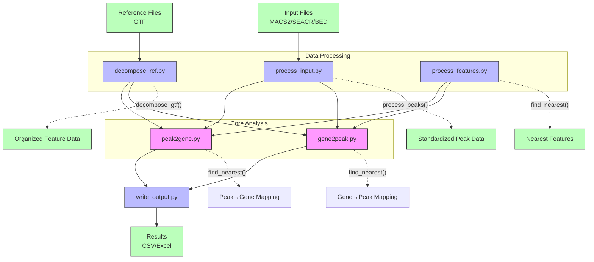

# PeakScout Architecture

PeakScout is a bioinformatics tool designed to bridge the gap between genomic peak data and gene annotations, enabling researchers to understand the relationship between regulatory elements and their target genes. At its core, PeakScout processes genomic peak files from common peak callers like MACS2 and SEACR, and maps them to nearby genes using reference genome annotations. The workflow begins with input processing, where peak files are standardized and reference GTF files are decomposed into chromosome-specific feature collections. The core analysis modules then perform bidirectional mapping: peak-to-gene identifies which genes are potentially regulated by specific genomic regions, while gene-to-peak reveals which regulatory elements might influence particular genes. Throughout this process, sophisticated nearest-feature detection algorithms handle the complex spatial relationships between genomic elements, considering factors like distance constraints and feature overlaps. Finally, the results are formatted into researcher-friendly CSV and Excel outputs, providing a comprehensive view of the genomic landscape that connects regulatory elements to their potential gene targets.

## Component Relationships

## Data Flow

1. **Input Processing**:
   - Peak files (MACS2, SEACR, BED) are processed by `process_input.py`
   - Reference GTF files are decomposed by `decompose_ref.py`

2. **Core Analysis**:
   - `peak2gene.py` maps peaks to nearby genes
   - `gene2peak.py` maps genes to nearby peaks
   - Both rely on feature processing functions from `process_features.py`

3. **Output Generation**:
   - Results are formatted and written to CSV/Excel by `write_output.py`

## Module Dependencies

- **Core Modules**: `peak2gene.py`, `gene2peak.py`
- **Supporting Modules**: `process_input.py`, `process_features.py`, `decompose_ref.py`, `write_output.py`
- **External Dependencies**: Polars, Pandas, NumPy
